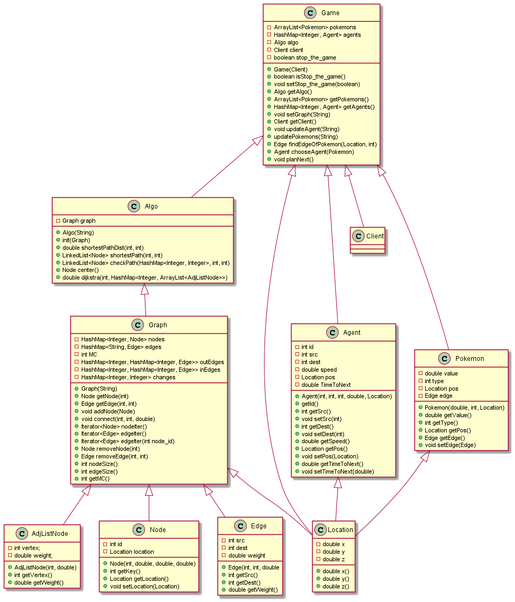

# OOP-Ex4
### welcome to the README


## what is this project?

In this project we implement a Pokémon game, which run on a given server. our goal is to rach as many "pokemons" as possible in the given time.


| *Our gui representation of the pokemon game case 5* |


## How to run
to activate the server, write in the terminal:
```bash
java -jar Ex4_Server_v0.0.jar <enter scenario number>
```
then run the main function in the class "Main" or if you preffer, run the "oop_ex4_jar" we created (both ways will have the same effect)


| *A short video clip of Our gui representation of the pokemon game case 5* |


# graph class:
* in the graph class we created two constructors (copy constructor and one that build the graph from given json file string).
* we used hash map to store the nodes information (key is the node id and the value is the nodeData itself).
* we used hash map to store the Edges information (key is the String made from the edge src id, comma and the edge dest id. The value is the edgeData).
* integer MC will be use to count changes in the graph.
* we used hash map inside hash map to store the out edges inforamtion (first key is the src id and the second is the dest id).
* we used hash map inside hash map to store the in edges inforamtion (first key is the src id and the second is the dest id).
* we used hash map to store changes of specific node outEdges (key is node id and value is amout of changes we made in edges coming out of the node).
* in order to remove a node from the graph we will use the edges iterator who will go over all the edges and remove them if the src or dest values mach with the selected node.
then we will delete the node from the hash map by using its id number.
* in order to remove an edge we will remove it from the 3 hash map in the graph. (edges hash map, out edges hash map and in edges hash map).


# algorithm class:
* in the algo class we have 1 constructer that build the graph from a given json string.
* the shortestPathDist function uses Dijkstra’s algorithm. The idea is to traverse all vertices of the graph by using BFS algo consept and use a Min Heap to store the vertices not yet included. Min Heap is used as a priority queue to get the minimum distance vertex from set of not yet included vertices. Time complexity of BFS is o(E+V) and complexity of operations like extract-min and decrease-key value is O(LogV) for Min Heap. therefore, overall time complexity is O(E+V)*O(LogV) which is O((E+V)*LogV) = O(ELogV). all the found distances are stored in a hash map (key is the node id). the function will return the requested data from the hash map (by using the dest id as key).
* the second shortestPathDist use the same idea as before but here we alse store in a hash map for every node we go to, the node we were in before (so if we are going in the edge u -> v we will put v as key and u as the value). in the end we will create a list from the hash map values (starting with the dest id we will place every NodeData as the new first object of the list).
* center function will use the same algorithm as we used before but now we will return for every node the max distance found (max distance from the list of min distances given to us by the Dijkstra's algorithm). after that we will find the node that returned the lowest distance and return it (the node).
* the load function use the graph pre-made constructer that works with a given json file name.
* the checkPath function is used to rerieve the list from the hash map (second shortestPathDist function).
* the dijkstra function operate the dijkstra algoritm we use in the center function.
* the findNextNode function is udes in the tsp function. we will call it every time we want to know the next node to go to from our current stand.


# Location class
* GeoLocation implementation for 3 dimension point in space


# Node class
* Implements node on a graph.


# Edge class
Implements the edge of the graph.


# Agent class
Implements a single agent object in the game


| *our agent* |


# Pokemon class
Implements a single pokemon object in the game


| *our pokemon in type 1* |


| *our pokemon in type -1* |


# Game class
* the game object represent the current game status. the game includes ArrayList of the game pokemon, HashMap of the agents, the Algo object (from the DirectedWeightedGraphAlgorithms interface) , the Client object of the current scenario and a boolean "stop the game". (all have get functions)
* we have 1 constructor. it recieve the Client object and create a new game with out any pokemons or agents (yet).
* the function setGraph will recieve a json string, and use the pre-made Algo constructor to create a new Algo and Graph.
* the function updateAgent recieve json string represent the new order of our agents and update the agents in the game.
* the function updatePokemons recieve json string represent the new order of our pokemons and update the pokemons in the game.
* the function findEdgeOfPokemon recieve a pokemon location as GeoLocation object and a pokemon type as integer and return the correct edge from the graph (the edge our pokemon will be on).
* the function chooseAgent recieve a pokemon object and return for the pokemon, the best agent to assign.
* the function planNext will plan for the next moves of the agents.

**few notes:
* the game will update itself each run by the values we recieve from the server.
* the game will basicly tell us the best move for the next turn.


## 4. Analysis Algorithms
Here is our score table:

| Stage | Grade | Moves |  
| :---: | :---: |:-----:|     
| 0 | 100 |  295  |
| 1  | 479 |  592  |
| 2  | 214 |  250  |
| 3  | 600 |  592  |
| 4  | 161 | 295   |
| 5  | 589 |  593  |
| 6  | 40 |  295  |
| 7  | 332 |  591  |
| 8  | 61 |  295  |
| 9  | 200 |  588  | 
| 10  | 50 |  291  |
| 11  | 981 |  590  |
| 12  | 40 |  290  |
| 13  | 200 |  592  |
| 14  | 90 |  296  |
| 15 | 180 |  591  |




| *our UML. note that all interfaces have exactly the same functions as the implementing classes. A single line represent interface implemention.* |
